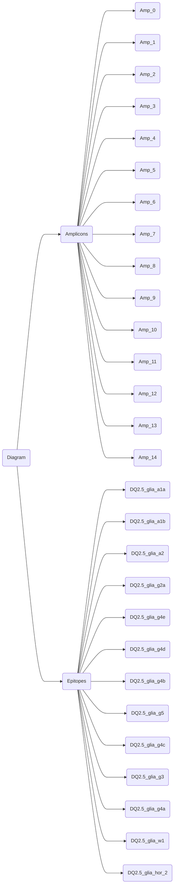

# wheatAHP
Implementation of the Analytic Hierarchy Process (AHP) to obtain the immunogenicity score of wheat lines based on their celiac disease (CD) epitopes matches on alpha- and gamma-gliadins amplicons by NGS and the score for oligopeptides based on an IFN-g ELISpot assays with fresh peripherical blood mononuclear cells (PBMCs).

# **Immunogenic score for 20-amino acid oligopeptides of wheat**

In the work of Tye-Din *et al.* (2010), they present a table of content with a score for each 20–amino acid oligopeptide based on their average relative frequency (mean normalized response of donor who responded to at least one peptide) of specific T cells present in blood. The 20-amino acid oligopeptides were pretreated with tissue transglutaminase (tTG). The wheat/barley/rye gluten peptide library design is described in Tye-Din's work.
\
\
\
*TYE-DIN, Jason A., et al. Comprehensive, quantitative mapping of T cell epitopes in gluten in celiac disease. Science translational medicine, 2010, vol. 2, no 41, p. 41ra51-41ra51.*

# **Search epitopes in oligopeptides**
We search for CD epitopes in the peptide library.
The 20-amino acid oligopeptides related to scores were presented without deamidation: we search non-deamidated epitopes in the peptide library. We assign to each epitope the maximum score value of the oligopeptide in which it is found.

# **AHP method**
With the ahpy python module (```pip install ahpy```), we assign a immunogenicity score to each genotype.

The AHP method is based on pair-wise comparisons. For each one, an intensity value is needed. The intensity value is the difference between both elements in the comparison. This difference can mean different things depending on the nature of the criterion. For example, in the 2nd level criterion related to the epitopes, the intensity value between two epitopes mean how much one epitope's immunogenicity is respect to the other epitope. In the following scheme, the intensity values calculation process is explained for each criterion.

The method is divided on three criteria:
* Criterion 1st level: Epitopes vs amplicons 'type'.

  In this case, all the intensity values upper to zero permitted in the AHP method were used Z(1,9), so we run the method nine times. This was because we do not have prior information about which of the elements (epitope or amplicons 'type') has more influence in the immunogenicity of a line. We choosen the intensities upper to zero because we assumed that the epitope sequence has more relevance, but not how much relevant it is over the number of epitopes disposed in the same amplicon.

* Criteria 2nd level:
  * **Epitopes:**

    To get the Pair-wise comparisons between epitopes based on the Tye-Din et a. (2010) immunogenic scores.
    The intensity values were calculated obtaining the log2(FC) between the immunogenic score of the epitopes two by two. The final value was scaled from 2 to 9 for positive values, from 1/9 to 1/2 for negative values, and 1 when the scores were equal for both epitopes. As a result, the weight of each epitope based on their influence in the final immunogenic potential score is displayed.
  * **Amplicons 'type':**

    Pair-wise comparisons between amplicons based on the number of epitopes in each one.
    The instensity values were calculated obtaining the log2(FC) between the number of epitopes present in each amplicons 'type' two by two. The final value was scaled from 2 to 9 for positive values and from 1/9 to 1/2 for negative values. As a result, the weight of each amplicon 'type' based on their influence in the final immunogenic potential score is displayed.
* Alternative lines:
  * **Epitopes:**
    
    Pair-wise comparisons between lines based on the frequency of each epitope in them.
    For each epitope, the intensity values were calculated obtaining the log2(FC) between the abundance of this epitope in the lines two by two. The final value was scaled from 2 to 9 for positive values, from 1/9 to 1/2 for negative values, and 1 when the epitope's abundance were equal for both lines.
  * **Amplicons 'types':**
    
    Pair-wise comparisons between lines based on the frequency of each amplicons 'type' (by number of epitopes in them) in each one.
    For each amplicon 'type', the intensity values were calculated obtaining the log2(FC) between the abundance of this 'type'' in the lines two by two. The final value was scaled from 2 to 9 for positive values, from 1/9 to 1/2 for negative values, and 1 when the amplicon 'type''s abundance were equal for both lines.




**Figure.** Diagram of the three criteria for AHP method.

# **Running the method**

```
python wheatAHP.py -i ./Input/Data_matrix_AHP.csv -o ./results/ -e ./Input/epitopes.fasta -d yes -ol ./Input/20_oligopeptides_scores.txt
```

# **Scores and AHP graph**
For each genotypes, a immunogenic score is assigned. For representation, the mean of score values changing the instensity value between epitopes and amplicons pair-wise comparisons in criteria 1 is calculated, and the standar deviation.

*Output: table_scores.txt*

Figure_scores.R


**Figure.** Immunogenic potential score per each genotype. The genus (BW: bread wheat, DW: durum wheat, HT: Tritordeum) and the presence of rye (N: no, Y: yes) are indicated. The mean of scores (changing intensity values in the criteria 1) and the standard deviation (bars) are represented.

# **Searching epitopes in NGS amplicons**
For searching epitopes and epitope variants with 1 or more mismatches in amplicon sequences of alpha and gamma gliadins and calculating their relative abundance in lines. In addition, calculation of the ratio of relative abundance variation between the epitope variant and the original epitope for each line is also implemented.

```
python ./findEpmismatch.py -i </path/to/file with amplicon frequencies in lines> -o </path/to/output dir> -e </path/to/epitopes fasta file> -d <remove epitope duplications: yes | no> -p <output prefix> -m <number of mismatches: 0, 1, ...> -a </path/to/amplicon peptides fasta file> -ep </path/to/file with epitope frequencies in lines>
```

**Output:**
* File with frequencies of epitope variants in lines, tsv format.
* File with ratio of frequency variation between the epitope variant and the original epitope, tsv format.